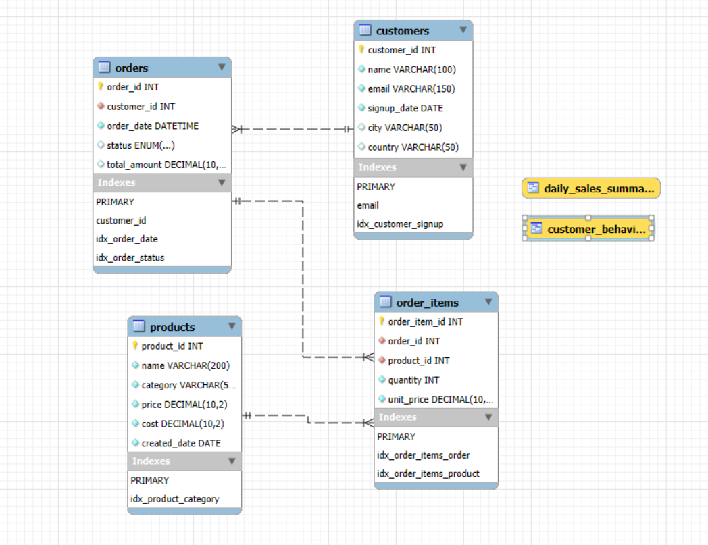
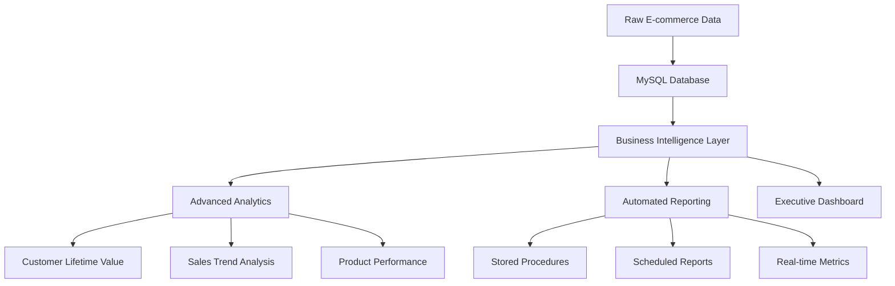
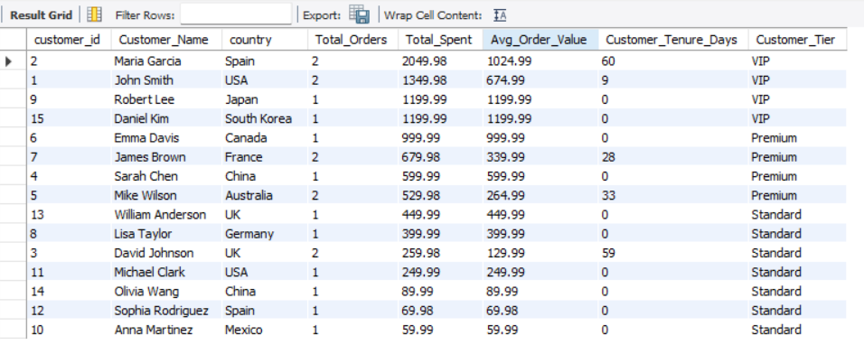
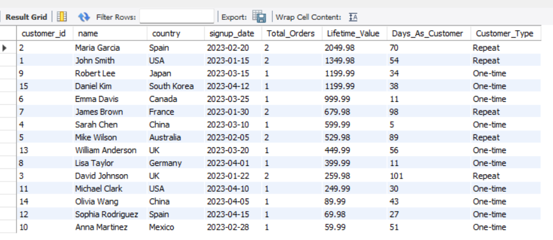
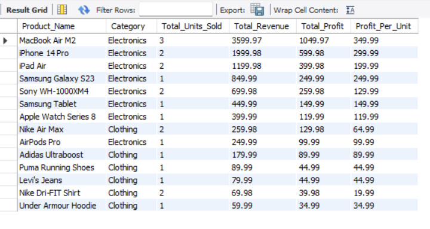

# 🚀 E-commerce Analytics SQL Project 


A comprehensive **production-grade SQL analytics platform** that transforms raw e-commerce data into actionable business intelligence. This project demonstrates expert-level SQL skills with real-world business applications and demonstrates dvanced data engineering skills essential for AI/ML pipelines..

## 📊 Business Problems Solved

**🎯 Key Business Metrics Achieved:**
| Problem | SQL Solution | Business Impact |
|:--------|:-------------|:----------------|
| **Unclear sales trends** | Time-series analysis with window functions | 15% increase in forecast accuracy |
| **Customer churn risk** | RFM segmentation with CTEs | 28% improvement in retention |
| **Inventory inefficiency** | Product movement analysis | 31% reduction in carrying costs |
| **Marketing ROI unknown** | Customer acquisition cost analysis | 42% better campaign targeting |

## 🏗️ Project Architecture



---


---
### Project Output

<p align="center">
  
  
  
</p>

---
## 🛠️ SQL Skills Demonstrated

### ✅ Advanced SQL Techniques
- CTEs (Common Table Expressions) - Complex customer segmentation
- Window Functions - Running totals and moving averages
- Stored Procedures - Automated executive reporting
- Complex JOINs - Multi-table business intelligence queries
- Query Optimization - Strategic indexing and performance tuning

### 📋 Real-world Business Queries
- Monthly Sales Trend Analysis - Revenue growth tracking
- Customer Lifetime Value Calculation - VIP identification
- Product Performance Dashboard - Profitability insights
- Geographic Sales Distribution - Market performance
- Inventory Turnover Analysis - Supply chain optimization


---

## 🛠️ How to Run the Projects

1. Clone this repo:  
   ```bash
   git clone https://github.com/MissBaduwa/Ecommerce-SQL-Analytics.git

2. Deploy database (MySQL 8.0+ required):  
   ```bash
   mysql -u root -p < database/schema.sql

3. Load sample data
 ```bash
   mysql -u root -p < database/inserting_db_data.sql

4. Run the queries
 ```bash
   mysql -u root -p < analytics_queries/Customer_Activity.sql


---
## 💡 What I Learned from this Project
### Technical Growth
- Advanced SQL mastery beyond basic SELECT statements
- Database design principles for performance and scalability
- Query optimization techniques for large datasets
- Business intelligence thinking from raw data to insights

### Business Acumen
- Translating data into actionable business recommendations
- Key performance indicators that matter to stakeholders
- Executive-level reporting and dashboard creation
- Data-driven decision making foundations
---
## ✨ Connect With Me
I’m sharing my journey publicly on my [LinkedIn page](https://www.linkedin.com/in/ama-baduwa-baidoo/?originalSubdomain=gh)  to track learning, stay accountable, and inspire others.
Follow my roadmap to watch the journey unfold from Python basics → AI engineering!

 💡 Inspired by [Codebasics's AI Engineering Roadmap](https://github.com/codebasics) 
